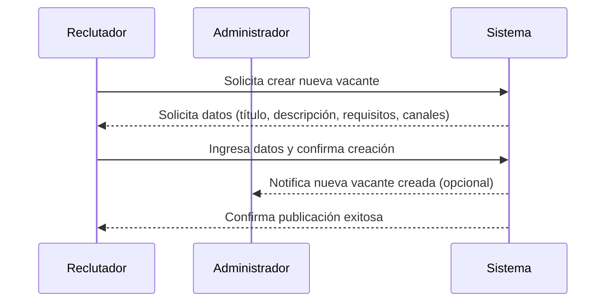
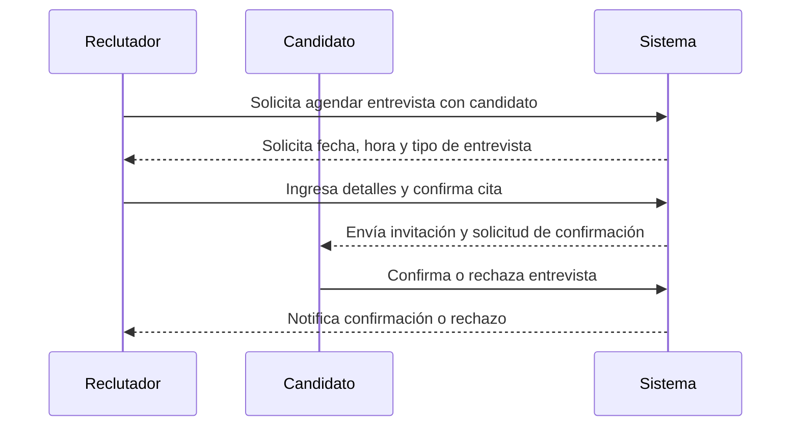
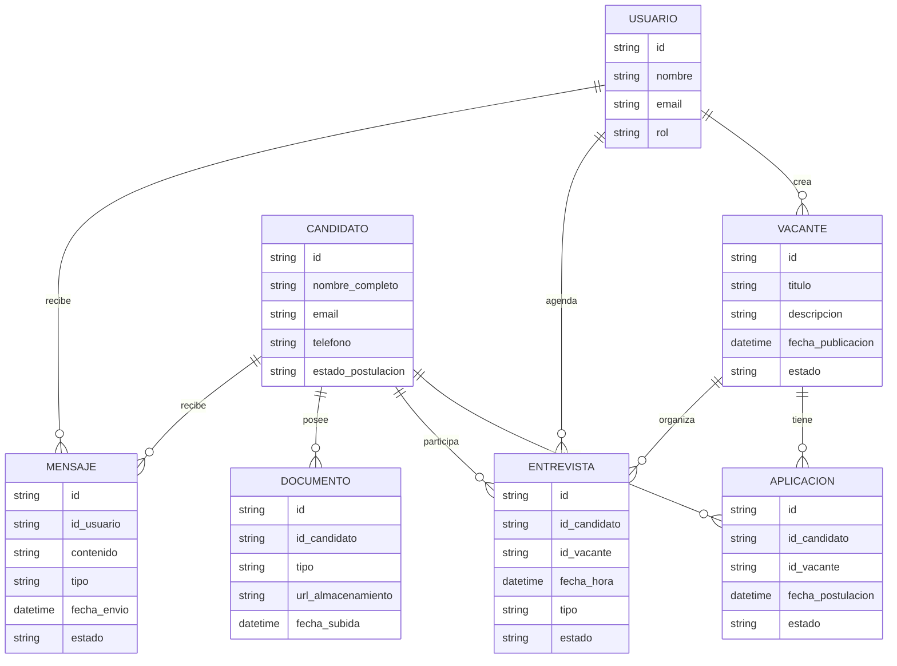
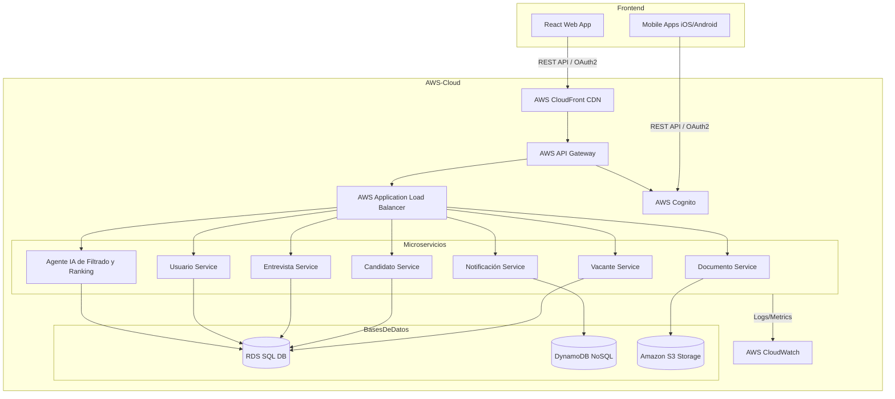
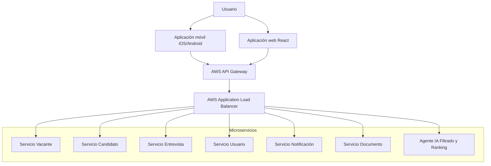
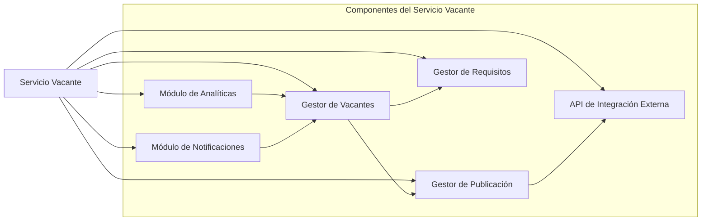

# LTI – Visión de Producto y Arquitectura

## 1. Descripción breve del software LTI

LTI es un sistema de seguimiento de candidatos (ATS) innovador y eficiente, diseñado para optimizar y agilizar los procesos de selección de talento en empresas modernas. LTI centraliza la gestión de vacantes, la recepción, el filtrado y la evaluación de candidatos, facilitando la comunicación y el control total del proceso desde una sola plataforma.

Una de las ventajas competitivas clave de LTI es que las funcionalidades de revisión y filtrado de candidatos, programación de entrevistas y gestión visual del pipeline de selección pueden ser gestionadas directamente a través de aplicaciones móviles para Android y iOS. Esto permite a los reclutadores acceder y administrar información crítica, agendar entrevistas y monitorizar el estado de los candidatos en tiempo real, desde cualquier lugar y en cualquier momento, usando su dispositivo móvil.

Gracias a estas capacidades móviles, LTI ofrece máxima flexibilidad y productividad, permitiendo una gestión ágil del proceso de selección y empoderando a los equipos de reclutamiento para tomar decisiones rápidas y basadas en datos, sin depender de estar en la oficina frente a una computadora

### Lean Canvas LTI – Applicant Tracking System

| Sección               | Detalle                                                                                     |
|-----------------------|--------------------------------------------------------------------------------------------|
| **Problema**          | - Procesos de selección manuales y dispersos<br>- Dificultad para filtrar y contactar candidatos rápidamente<br>- Falta de movilidad y acceso ágil desde el móvil<br>- Baja trazabilidad y poca visibilidad del pipeline de selección |
| **Segmentos clientes**| - Empresas medianas y grandes<br>- Reclutadores internos<br>- Consultoras de selección<br>- Equipos móviles de reclutamiento        |
| **Propuesta de valor única** | - Centralización total del proceso de selección<br>- Gestión de candidatos, entrevistas y pipeline 100% móvil y multiplataforma<br>- Ahorro de tiempo y decisiones ágiles desde cualquier lugar         |
| **Solución**          | - Creación de vacantes y publicación multicanal<br>- Filtros automáticos, ranking y gestión de candidatos en web y móvil<br>- Agendamiento de entrevistas y gestión visual del pipeline desde app móvil y escritorio    |
| **Canales**           | - Web propia (SaaS)<br>- Aplicaciones móviles Android/iOS<br>- Email marketing<br>- LinkedIn, redes sociales<br>- Marketplace de soluciones HR Tech                                              |
| **Fuentes de ingresos**| - Suscripción mensual/usuario (modelo SaaS)<br>- Paquetes premium por funcionalidades avanzadas<br>- Implementación y soporte empresarial                                    |
| **Estructura de costes** | - Desarrollo y mantenimiento software<br>- Infraestructura en la nube<br>- Soporte y onboarding<br>- Marketing y ventas<br>- Actualizaciones y seguridad de datos                            |
| **Métricas clave**    | - Cantidad de procesos gestionados<br>- Tiempo promedio de contratación<br>- % de uso móvil vs web<br>- Tasa de éxito de cierres<br>- Satisfacción del usuario<br>- Retención y churn           |
| **Ventaja competitiva** | - Gestión auténticamente móvil de funcionalidades críticas<br>- Experiencia simplificada y centrada en el usuario reclutador<br>- Escalabilidad y flexibilidad avanzada para equipos modernos  |


## 2. Casos de Uso Principales

A continuación una tabla con todos los casos de uso propuestos

| Funcionalidad                               | Nombre de caso de uso               | Descripción de caso de uso                                          | Roles de usuario              |
|---------------------------------------------|-------------------------------------|----------------------------------------------------------------------|-------------------------------|
| Gestión de vacantes                        | Crear puesto de trabajo (MVP)       | Crear una nueva vacante y publicarla en diferentes canales.           | Reclutador, Administrador     |
|                                             | Editar vacante                      | Modificar la información de una vacante previamente creada.           | Reclutador                    |
| Recepción y organización de aplicaciones    | Centralizar aplicaciones            | Recibir y almacenar todas las postulaciones en la plataforma.         | Reclutador, Administrador     |
|                                             | Exportar aplicaciones               | Descargar información de aplicaciones recibidas en diferentes formatos.| Reclutador, Administrador     |
| Revisión y filtrado de candidatos           | Filtrar y rankear candidatos (MVP)  | Visualizar/aplicar filtros y ranking a candidatos; disponible en móvil.| Reclutador                    |
|                                             | Buscar candidato por criterios       | Buscar candidatos por palabras clave, experiencia o competencias.      | Reclutador                    |
| Comunicación automatizada                  | Enviar notificaciones automáticas   | Enviar mensajes automáticos a candidatos mientras avanza el proceso.   | Reclutador, Sistema           |
|                                             | Personalizar mensajes               | Modificar el contenido de los mensajes enviados.                       | Reclutador                    |
| Programación de entrevistas                 | Agendar entrevistas (MVP)           | Asignar entrevistas de manera centralizada, desde web o app móvil.     | Reclutador, Candidato         |
|                                             | Confirmar/cancelar entrevista       | Aceptar o cancelar entrevistas agendadas.                              | Reclutador, Candidato         |
| Pruebas y evaluaciones online               | Enviar pruebas                      | Mandar pruebas a candidatos seleccionados.                             | Reclutador                    |
|                                             | Revisar resultados                  | Analizar resultados de pruebas directamente en la plataforma.          | Reclutador                    |
| Gestión del pipeline de selección           | Visualizar pipeline y estado        | Ver el avance de cada candidato en el proceso, desde cualquier dispositivo.| Reclutador                    |
|                                             | Modificar estado de candidato       | Cambiar la etapa de cada candidato desde web o móvil                   | Reclutador                    |
| Reporting y analítica básica                | Acceder a métricas y reportes       | Consultar estadísticas: tiempos, fuentes y ratios del proceso.         | Reclutador, Administrador     |
|                                             | Descargar reportes                  | Descargar reportes y gráficas para presentaciones.                     | Reclutador, Administrador     |
| Gestión documental                         | Adjuntar y consultar documentos     | Guardar CVs, cartas y archivos relevantes de candidatos.               | Reclutador, Administrador     |
| Cumplimiento de normativas                  | Solicitar consentimiento            | Registrar aceptación de protección de datos personales.                | Candidato, Sistema            |
|                                             | Generar auditorías                  | Consultar/regenerar registros para auditorías.                         | Administrador, Auditoría      |


Los casos de uso principales seleccionados son:

* Crear puesto de trabajo (MVP)

Descripción detallada: Permite al reclutador o administrador crear una nueva vacante ingresando toda la información relevante (nombre de puesto, requisitos, salario, canal de publicación, etc.) y publicar la oferta en portales, web corporativa y redes sociales desde la plataforma.

Roles de usuario asociados: Reclutador, Administrador



* Filtrar y rankear candidatos (MVP)

Descripción detallada: El reclutador puede visualizar y filtrar los candidatos que han aplicado a una vacante según criterios definidos (palabras clave, nivel de experiencia, formación, etc.). Además, la interfaz está disponible en la aplicación móvil, lo que permite gestionar esta tarea completamente desde dispositivos Android e iOS.

Roles de usuario asociados: Reclutador



* Agendar entrevistas (MVP)

Descripción detallada: Facilita la asignación de entrevistas entre reclutadores y candidatos, permitiendo elegir fecha, hora, tipo de entrevista (virtual/presencial) y enviar confirmación tanto desde la web como desde la app móvil. Los candidatos pueden recibir notificaciones y confirmar o rechazar fechas propuestas.

Roles de usuario asociados: Reclutador, Candidato


## 3. Modelo de Datos




## 4. Diseño Alto Nivel

### Arquitectura de Microservicios para ATS online LTI

**Descripción Detallada**

Microservicios independientes con base de datos propia
Cada microservicio tiene responsabilidad única, contiene la lógica relacionada y maneja su propia base de datos para evitar dependencias acopladas y escalar independientemente. Las bases de datos pueden ser SQL o NoSQL según el caso. Ejemplos: microservicio de Vacantes, Candidatos, Entrevistas, Usuarios, Notificaciones, Documentos.

**Comunicación frontend-backend mediante REST API**

* El frontend (web React y móviles iOS/Android) consumen APIs REST expuestas por un API Gateway.

* El API Gateway gestiona autenticación, autorización, enrutamiento y balanceo de carga.

**Proveedor Cloud: AWS**

* Microservicios desplegados en contenedores con Kubernetes (EKS) o AWS Fargate para serverless.

* Bases de datos independientes con servicios gestionados (RDS para SQL, DynamoDB para NoSQL).

* API Gateway de AWS para gestionar APIs REST.

* Capa de Load balancing con AWS Application Load Balancer (ALB).

* CDN para frontend estático (React y recursos móviles) usando AWS CloudFront.

* Almacenamiento de documentos con Amazon S3.

* Autenticación y autorización gestionadas por AWS Cognito (acceso móvil y web).

* Logs centralizados con AWS CloudWatch y monitoreo con AWS X-Ray.

**Frontend Web**

React para UI, desplegado en S3 (como sitio estático) con CloudFront.

Comunicación con backend vía REST API protegida por OAuth 2.0 mediante Cognito.

**Frontend Móvil**

Aplicaciones nativas iOS (Swift) y Android (Kotlin).

Comunicación API REST con backend con librerías estándar para autenticación (Cognito SDK).

**Seguridad**

Autenticación centralizada con AWS Cognito.

Comunicación cifrada (HTTPS/TLS).

Políticas IAM estrictas en AWS para acceso a recursos.

Escalabilidad y alta disponibilidad

Auto escalado en EKS/Fargate.

ALB distribuye tráfico entre réplicas.

CDN con edge locations global para baja latencia.

### Technologies Table

| Component               | Technology / Language         |
| ----------------------- | ----------------------------- |
| Backend Microservices   | Node.js (Express.js)          |
| Database                | AWS RDS (PostgreSQL)          |
| Authentication          | AWS Cognito                   |
| Messaging/Queue         | AWS SQS                       |
| Notification System     | AWS SNS                       |
| API Gateway             | AWS API Gateway               |
| Container Orchestration | AWS ECS (Fargate)             |
| Web Frontend            | React.js                      |
| Mobile Frontend         | Swift (iOS), Kotlin (Android) |
| CDN                     | AWS CloudFront                |

### Diagram



## 5. Diagrama C4

### Context
```mermaid
graph TD
    user[Usuario Reclutador / Candidato]
    mobileApp[Aplicación móvil iOS/Android]
    webApp[Aplicación web React]

    LTI[ATS LTI Sistema]

    user --> mobileApp
    user --> webApp

    mobileApp --> LTI
    webApp --> LTI

    otherSystems[Otros Sistemas Externos (Correo, Redes Sociales, Servicios de Pago)]
    LTI -.-> otherSystems
```

### Containers



### Components, Servicio Vacante



Descripción de componentes

* Gestor de Vacantes: Crea, edita y elimina vacantes. Mantiene las propiedades base (título, descripción, estado).

* Gestor de Publicación: Controla la publicación de vacantes en múltiples canales externos (portales, redes sociales).

* Gestor de Requisitos: Administra requisitos necesarios para cada vacante (habilidades, experiencia).

* Módulo de Analíticas: Proporciona métricas sobre vacantes como visitas, aplicaciones recibidas y tiempo activo.

* Módulo de Notificaciones: Gestiona envío de notificaciones relacionadas con la vacante (nuevas aplicaciones, recordatorios).

* API de Integración Externa: Facilita la comunicación con servicios externos para publicación y sincronización.

### Code, Gestor de Vacantes.

```mermaid
classDiagram
    class JobManager {
        +createJob(data)
        +getJobById(id)
        +updateJob(id, data)
        +deleteJob(id)
        +listJobs(filter)
    }

    class Job {
        +id: string
        +title: string
        +description: string
        +requirements: string[]
        +status: string
        +publicationChannels: string[]
        +createdAt: datetime
        +updatedAt: datetime
    }

    class JobRepository {
        +save(job: Job)
        +findById(id: string) Job
        +update(id: string, job: Job)
        +delete(id: string)
        +find(filter) Job[]
    }

    class JobService {
        +validateJobData(data)
        +notifyPublication(job: Job)
    }

    JobManager "1" o-- "*" Job : manages >
    JobManager "1" o-- "1" JobRepository : uses >
    JobManager "1" o-- "1" JobService : uses >
```mermaid

Explicación del diagrama para Product Owner

* JobManager: Es la clase central que provee las funciones para crear, listar, editar, y eliminar vacantes. Es la interfaz que usa el resto del sistema para manipular el recurso "Vacante".

* Job: Representa el modelo de datos para una vacante, con todos sus atributos, como título, requisitos, estado, y canales donde será publicada.

* JobRepository: Se encarga de la persistencia, es decir, guardar, buscar, modificar y borrar los datos de las vacantes en la base de datos (en nuestro caso PostgreSQL en AWS RDS).

* JobService: Contiene lógicas auxiliares, como la validación de datos y la notificación para cuando una vacante se publica. Es una capa que ayuda a mantener el código organizado y modular.


